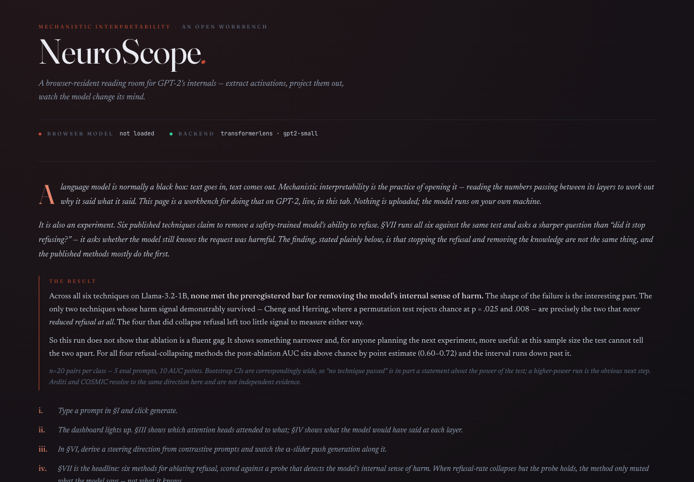
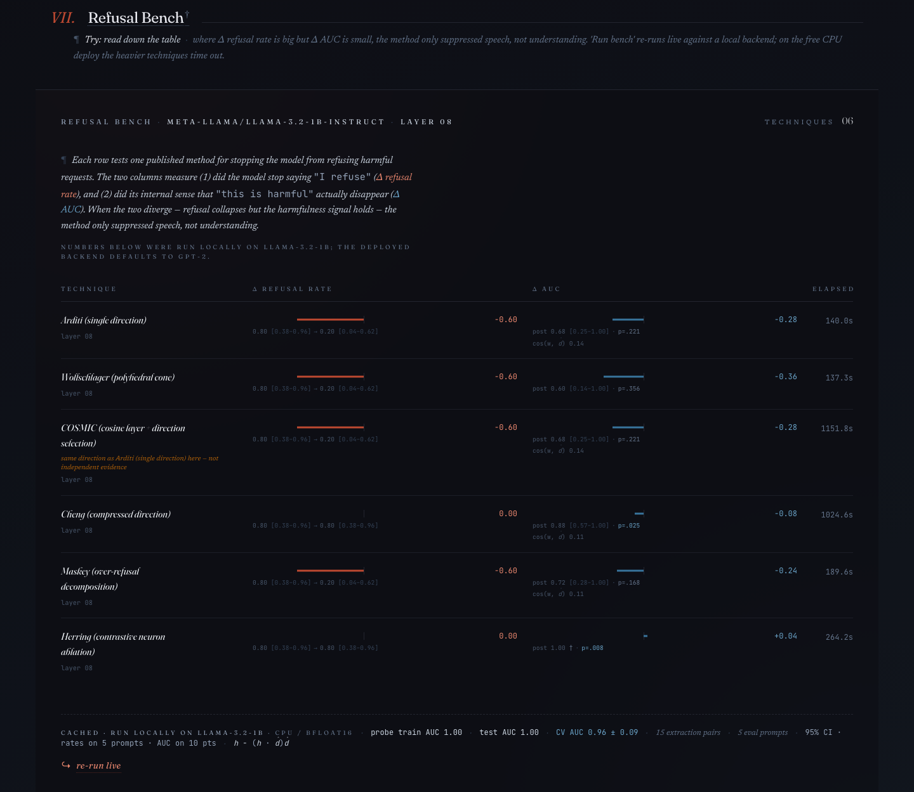

# NeuroScope

> Open a URL, watch GPT-2 think. A browser-native mechanistic interpretability
> workbench — extract activations, read attention head by head, steer generation
> along a direction you derived yourself, and compare six published
> refusal-ablation techniques on the same evidence.

**[Open the workbench →](https://neuroscope-interp.netlify.app)**  ·  backend: [`lymnal/neuroscope-api`](https://huggingface.co/spaces/lymnal/neuroscope-api)



The model runs in your tab via WebGPU. Nothing you type is uploaded; the Python
backend is only used for the analyses that need TransformerLens hooks
(logit lens, gradients, steering, ablation).

## The finding

The bench in §VII runs six published techniques for removing a safety-trained
model's ability to refuse, then asks a sharper question than "did it stop
refusing?" — it asks whether the model still *represents* the request as
harmful, using a probe on the residual stream.

**On Llama-3.2-1B, none of the six met the preregistered dissociation
criterion.** The shape of the failure is the interesting part: the only two
techniques whose harm signal demonstrably survived — Cheng (p = .025) and
Herring (p = .008) — are precisely the two that never reduced refusal at all.
The four that did collapse refusal left too little signal to measure either
way.

So this is not evidence that ablation is a fluent gag. It is the narrower,
more actionable result that **at n=20 the test cannot tell the two apart**. For
all four refusal-collapsing methods, post-ablation AUC sits above chance by
point estimate (0.60–0.72) with an interval running down past it. A
higher-power run is the obvious next step.



Two caveats the table encodes and you should not read past: Arditi and COSMIC
resolve to the same direction here and are **not** independent evidence
(COSMIC's per-layer candidate *is* diff-of-means, so its search reduces to
layer selection, and it picked Arditi's layer); and n=20 pairs per class
leaves 5 eval prompts and 10 AUC points, so every interval is wide.

## What's inside

- **Frontend**: Vite + React + TypeScript (strict), transformers.js in a Web Worker for in-browser GPT-2 inference.
- **Backend**: FastAPI + TransformerLens. Supports `gpt2-small` (default) and `meta-llama/Llama-3.2-{1B,3B}-Instruct` (gated; requires `HF_TOKEN`).
- **Refusal Bench**: the harness runs six published refusal-ablation techniques head-to-head — Arditi, Wollschlager, COSMIC, Cheng, Maskey, and Herring — against a shared harmfulness probe (Zhao 2507.11878–style scoring). The shipped result (`public/bench/refusal_bench_default.json`) is a **complete six-technique run on Llama-3.2-1B**, layer 8, CPU/bfloat16, seed 42, no errored rows. Live re-runs via `POST /refusal-bench` locally; the full sweep takes ~50 min on CPU at n=20, so the deploy serves the cached artifact rather than running it.

  Read the numbers with their intervals: the run uses 20 pairs per class, which leaves 5 eval prompts and 10 AUC points, and the bootstrap CIs on post-ablation AUC are correspondingly wide. Zero techniques met the preregistered dissociation criterion. `docs/BLOG_POST_DRAFT.md` has the full table and the caveats.
- **Statistical honesty layer**: Wilson 95% CIs on refusal rates (`wilson_ci`), percentile-bootstrap 95% CIs on probe AUC (`bootstrap_auc_ci`), and a one-sided permutation test that post-ablation AUC beats chance (`auc_permutation_p`) — seeded and deterministic, unit-tested in `backend/tests/test_stats.py`, rendered as ± bands in the leaderboard UI.
- **Ablation primitive**: projection-removal hook (`h − (h · d̂)d̂`) exposed at `POST /ablate-direction` with a `SteeringPanel` UI for interactive before/after generation.

## Research context

I'm building this while teaching myself mechanistic interpretability. The 2024–26 refusal-direction literature — and where the single-direction claim (Arditi 2024) breaks down under follow-up work (Wollschlager 2025, Zhao 2025, Cheng 2604.08524, Maskey 2603.27518, Herring 2605.12290) — is summarized in [`docs/RESEARCH_LANDSCAPE_2026.md`](docs/RESEARCH_LANDSCAPE_2026.md). The bench is the headline artifact: it operationalizes the Zhao dissociation criterion across all six published techniques on the same data.

## Run locally

The frontend alone is enough to see attention, generation, and the cached
bench — it talks to the public backend by default, so you do not need Python
unless you want to change the analysis code.

```bash
npm install
npm run dev                              # → http://localhost:3001
```

To run the backend yourself, point the frontend at it with
`VITE_API_BASE=http://localhost:8000` in `.env.local`:

```bash
cd backend
pip install -r requirements.txt
uvicorn main:app --reload --port 8000    # OpenAPI at /docs
```

With no `VITE_API_BASE` set, a page served from localhost uses
`http://localhost:8000` and a deployed page uses the public Space — so neither
environment needs configuration to work.

For Llama-3.2-{1B,3B} you must accept the license on Hugging Face and export `HF_TOKEN` before starting the backend. GPT-2 needs no token.

## Public backend

The FastAPI backend runs at
[`lymnal/neuroscope-api`](https://huggingface.co/spaces/lymnal/neuroscope-api)
on a free CPU Space (`https://lymnal-neuroscope-api.hf.space`). It sleeps after
~48h idle and takes 30–60s to cold-start; the UI shows a *waking the space…*
state while that happens.

The free tier serves GPT-2. Re-running the full six-technique bench live takes
~50 min on CPU and will time out there — the deployed leaderboard reads the
cached Llama-3.2-1B artifact in `public/bench/` instead, and says so in the UI.

## Project layout

| Path | Purpose |
|---|---|
| `src/engine/` | Web Worker — transformers.js inference, tokenization, generation |
| `src/analysis/` | Pure tensor math (no React, no DOM, no async) |
| `src/components/` | UI: `RefusalBenchLeaderboard`, `SteeringPanel`, `AblationHero`, etc. |
| `backend/research.py` | TransformerLens-backed analysis (logit lens, attention, steering, ablation) |
| `backend/refusal_bench/` | Bench harness + six technique implementations + harmfulness probe |
| `public/bench/` | Cached bench result served as a Vite static asset |
| `docs/` | Architecture, deployment, research landscape, testing strategy |

## Stack

Vite · React 18 · TypeScript strict · transformers.js v3 · Zustand · Tailwind + Radix · FastAPI · TransformerLens · PyTorch

## Status

Active development. The backend is **live** on HuggingFace Spaces; the frontend
deploy is the remaining step — see [`docs/DEPLOYMENT.md`](docs/DEPLOYMENT.md).

Known limits, stated plainly: the bench artifact is n=20 and underpowered
(a higher-power run is the top open task); the browser path needs WebGPU
(Chrome/Edge 113+, Safari 18+); and `src/engine/worker.ts`'s pipeline-factory
DI seam is vestigial — `loadModel` does not route through it, so swapping the
factory redirects nothing.

## License

MIT
